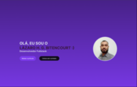

# 💻 Meu Portfólio Frontend

Bem-vindo ao repositório do meu portfólio! Este projeto foi desenvolvido para a disciplina de **Desenvolvimento Web I**, com o objetivo de demonstrar habilidades fundamentais na criação de interfaces modernas, responsivas e semânticas.

## 🚀 Tecnologias Utilizadas

Para este projeto, foquei no "Core" do desenvolvimento frontend e em ferramentas de produtividade:

- **HTML5:** Estruturação semântica para melhor acessibilidade e SEO.
- **CSS3:** Estilização avançada utilizando **Flexbox** e **Grid Layout** para layouts complexos.
- **Bootstrap 5:** Agilidade no desenvolvimento e garantia de componentes consistentes.
- **JavaScript (ES6+):** Manipulação do DOM, eventos e dinamismo na página.
- **Design Responsivo:** Conceitos de *Mobile-First* para funcionamento perfeito em qualquer tela.

### 🎨 CSS & Estilização
- **Cores e Fundo:** Uso de `color`, `background-color` e `background-image` para a identidade visual.
- **Fontes e Texto:** Ajustes de `font-size`, `font-weight` (negrito) e `text-align` (alinhamento).
- **Espaçamento (Box Model):** Controle de distâncias com `margin` (externo) e `padding` (interno).
- **Bordas:** Uso de `border` e `border-radius` para arredondar cantos de elementos e botões.
- **Dimensões:** Definição de tamanhos fixos e flexíveis com `width`, `height` e `max-width`.

### ⚡ Bootstrap 5 (Classes Prontas)
- **Estrutura:** Uso de `.container`, `.row` e `.col` para organizar o conteúdo em colunas.
- **Espaçamento Ágil:** Classes como `mt-3` (margem superior) e `p-2` (preenchimento) para ajustes rápidos.
- **Componentes:** Aplicação de botões (`btn`) e cartões (`card`) nativos do framework.

### 📱 Responsividade Simples
- **Layout Adaptável:** Uso de porcentagens e classes do Bootstrap para o site não "quebrar" no celular.
- **Imagens Flexíveis:** Uso da classe `.img-fluid` para que as fotos se ajustem ao tamanho da tela.

## 📁 Estrutura do Projeto

```text
├── index.html       # Página principal
├── css/             # Folhas de estilo (Custom)
├── js/              # Scripts de comportamento
└── assets/          # Imagens e ícones


```  

## 🚀 Protótipo no Figma
Clique na imagem abaixo para navegar pelo protótipo diretamente no Figma:

[](https://www.figma.com/proto/R4N4FVJjPhat9BCJFFNN96/portifolio?node-id=10-69&p=f&t=R5ylrkWmIptKbMx2-1&scaling=min-zoom&content-scaling=fixed&page-id=0%3A1)
